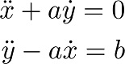
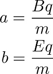
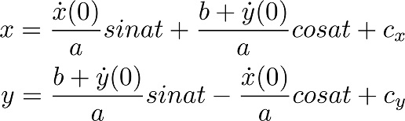
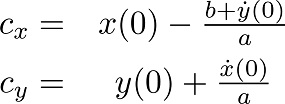

# A Charged Particle Simulator
An HTML demo of a charged particle travelling through magnetic and electric fields.
The main file (particle-demo.html) displays a simulation that runs in the web browser, showing a particle as it moves through electric and magnetic fields.

The colour of the particle is used to represent its charge:
- Red : Positively charged
- Blue : Negatively charged
- Green : Neutral

The default values of the simulation are used to show an example curved path, however they are unrealistic at the moment. Realistic values will be added in an update shortly.

The basic equations governing the system are:

Where we define a and b to be:

These give the solution:

Where the constants of integration (to give the correct starting points for x and y) can be found from:

